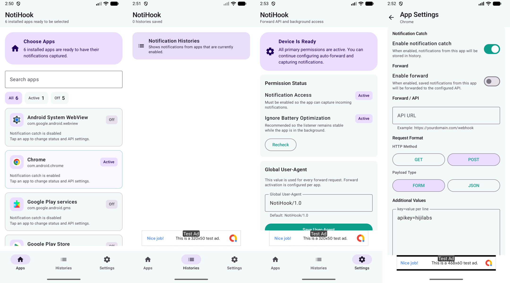

<p align="center">
  
</p>

<div align="center">

# NotiHook

</div>

<p align="center">
  <strong>Catch Notifications. Trigger APIs.</strong>
</p>

<div align="center">

<a href="./README.en.md">English README</a>

</div>

<p align="center">
  
  
  
  
  <br/>
  <br/>
  
  <a href="https://github.com/rickicode/NotiHook/stargazers">
    
  </a>
  <a href="https://github.com/rickicode/NotiHook/releases/latest">
    
  </a>
</p>

<p align="center">
  <a href="https://github.com/rickicode/NotiHook/releases/latest">
    
  </a>
  <a href="https://apps.obtainium.imranr.dev/redirect.html?r=obtainium://add/https://github.com/rickicode/NotiHook/">
    
  </a>
</p>

<p align="center">
  
</p>

NotiHook adalah aplikasi Android open source untuk developer yang dibuat agar notifikasi dari aplikasi pilihan bisa ditangkap, disimpan, dan diteruskan ke endpoint API dengan alur yang tetap ringan. APK release-nya juga tetap kecil, sekitar 6 MB.

## Fitur Utama

- Menangkap notifikasi dari aplikasi yang dipilih
- Tetap ringan dengan ukuran APK sekitar 6 MB
- Menyimpan histori notifikasi secara lokal untuk audit dan pengecekan ulang
- Meneruskan notifikasi ke API secara opsional
- Mengatur URL, method, payload type, dan additional values per aplikasi
- Memverifikasi izin sistem yang dibutuhkan agar catcher tetap berjalan di background

## Tujuan Aplikasi

NotiHook dibuat untuk developer yang perlu menjadikan notifikasi Android sebagai sumber data operasional. Aplikasi ini cocok untuk kebutuhan pencatatan notifikasi, integrasi webhook sederhana, automasi backend, atau monitoring transaksi dari aplikasi tertentu tanpa harus membuat integrasi native dari tiap vendor.

## Install via Obtainium

NotiHook juga bisa dipasang dan dipantau updatenya lewat Obtainium karena source rilisnya memakai GitHub Releases.

Source URL:

```text
https://github.com/rickicode/NotiHook
```

Langkah singkat:

1. Buka Obtainium
2. Tambahkan app baru dari source GitHub
3. Masukkan URL repo `https://github.com/rickicode/NotiHook`
4. Simpan, lalu install dari release terbaru

## Alur Penggunaan

1. Aktifkan `Notification Access`
2. Izinkan `Ignore Battery Optimization` jika dibutuhkan
3. Pilih aplikasi yang ingin dicatat
4. Aktifkan `notification catch` per aplikasi
5. Jika perlu, aktifkan `forward`
6. Isi URL API, method, payload type, dan additional values

## Konfigurasi

### Global

- `User-Agent`

Default:

```text
NotiHook/1.0
```

### Per Aplikasi

- `Enable notification catch`
- `Enable forward`
- `API URL`
- `HTTP Method`
- `Payload Type`
- `Additional Values`

## Payload Notifikasi

Field notifikasi utama yang digunakan:

- `title`
- `text`
- `bigtext`
- `subtext`
- `infotext`
- `name`
- `pkg`

Contoh payload:

```json
{
  "apikey": "hijilabs",
  "bigtext": "Transaksi pembayaran invoice HJ4133362026031119585662 Sebesar Rp 111 dengan QRIS Statis berhasil dibayar. RRN : 1mi5mnz51389",
  "infotext": "",
  "name": "bale merchant",
  "pkg": "com.btn.btnmerchant",
  "subtext": "",
  "text": "Transaksi pembayaran invoice HJ4133362026031119585662 Sebesar Rp 111 dengan QRIS Statis berhasil dibayar. RRN : 1mi5mnz51389",
  "title": "Bayar Transaksi QR Statis Merchan"
}
```

## Perilaku Forward

Forward hanya berjalan jika semua syarat ini terpenuhi:

- `notification catch` aktif
- `forward` aktif
- `API URL` valid
- `additional values` valid

Jika payload type dipilih `JSON`, data dikirim sebagai:

```text
Content-Type: application/json; charset=utf-8
```

Jika payload type dipilih `FORM`, data dikirim sebagai:

```text
Content-Type: application/x-www-form-urlencoded
```

## Izin Yang Digunakan

Karena fungsi aplikasi ini memang bekerja di level sistem Android, beberapa izin dan kemampuan berikut digunakan:

- `Notification Listener`
- `REQUEST_IGNORE_BATTERY_OPTIMIZATIONS`
- `QUERY_ALL_PACKAGES`
- `INTERNET`

## Catatan

- `QUERY_ALL_PACKAGES` dipakai agar daftar aplikasi target dapat tampil lebih lengkap di beberapa device, termasuk Samsung.
- Distribusi APK langsung di luar Play Store bisa lebih mudah ditandai oleh Play Protect karena aplikasi ini menangani notifikasi, background behavior, dan forwarding ke API.
